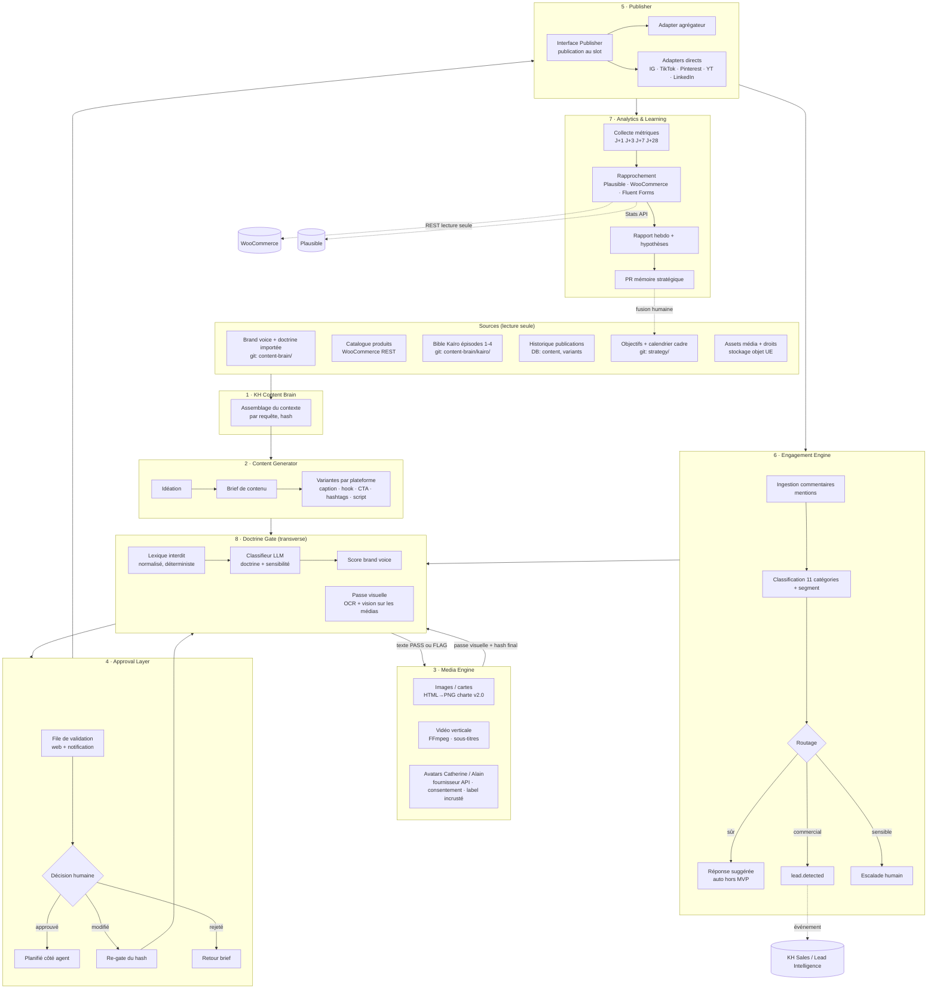
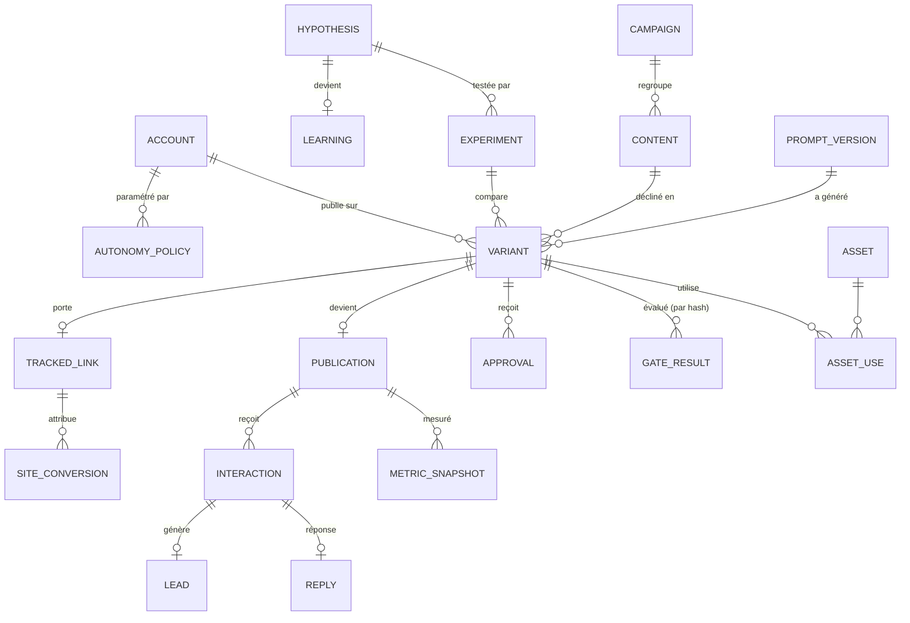
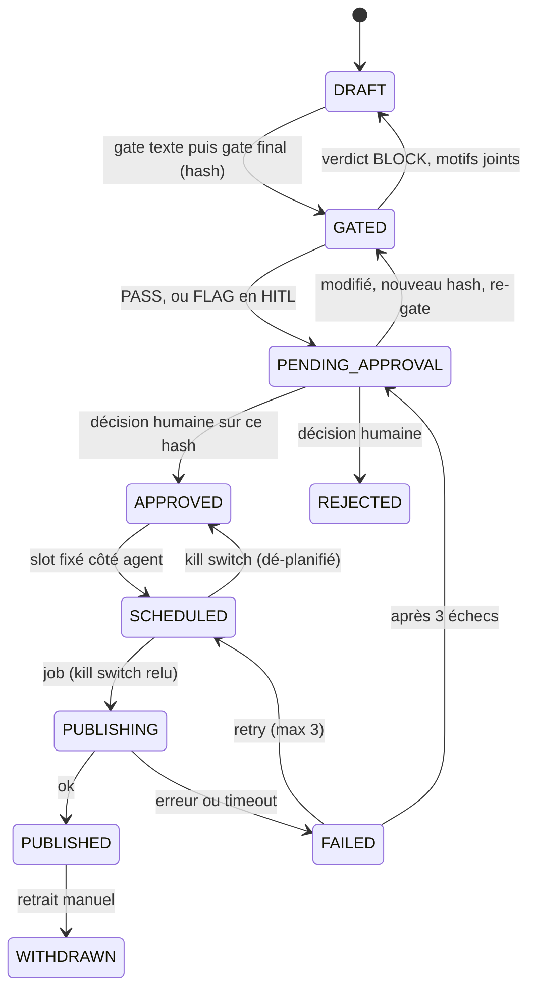
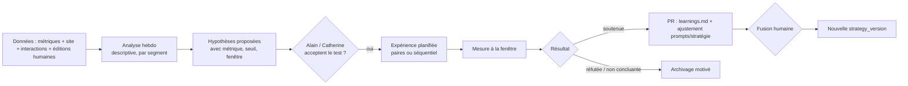

# KH Social Agent — Architecture cible

- **Date** : 2026-09-11, révisée 2026-09-12 après revue adversariale à contexte frais (25 constats, 23 intégrés)
- **Statut** : 🟡 proposition Phase 1, **à valider par Alain** avant tout développement
- **Périmètre** : agent de croissance d'audience pour Koinobori House sur Instagram, TikTok, Pinterest, YouTube Shorts, LinkedIn (occasionnel)
- **Brief source** : brief « KH Social Agent » transmis par Alain le 2026-09-11 (14 sections + instruction connecteurs + instruction réemploi des skills OMA)
- **Documents liés** : [02-apis-plateformes.md](02-apis-plateformes.md) (capacités API vérifiées) · [03-mvp-backlog.md](03-mvp-backlog.md) (MVP, backlog, complexité) · [04-decisions.md](04-decisions.md) (points à trancher) · [05-audit-existant.md](05-audit-existant.md) (skills et corpus réutilisables)

---

## 0. Résumé en dix lignes

1. Le KH Social Agent est un **service séparé du site** (repo, hébergement, base propres), relié au site par des interfaces stables et **en lecture seule** (UTM, WooCommerce REST, Plausible, Fluent Forms). Il n'écrit rien dans WordPress.
2. Il optimise l'entonnoir **notoriété → trafic qualifié → leads → ventes → fidélisation**, jamais les likes.
3. Architecture en **7 modules** conformes au brief §8 : Content Brain · Content Generator · Media Engine · Approval Layer · Publisher · Engagement Engine · Analytics & Learning.
4. Un **8ᵉ module transverse**, le **Doctrine Gate**, applique mécaniquement la doctrine éditoriale Koinobori House (Chine jamais citée, aucune mention de production, pas de « fabriqué en France », pas de volume de stock, vocabulaire livraison interdit) sur le **texte et sur l'image**, avant toute validation humaine, et sur le texte **réellement publié** (hash).
5. Trois niveaux d'autonomie paramétrables par compte × territoire : AUTO, SEMI-AUTO, HUMAN-IN-THE-LOOP. **Aucune publication sensible sans humain. Aucune auto-approbation au MVP.**
6. La publication passe par une **interface `Publisher` unique** avec deux implémentations interchangeables : agrégateur (rapide, pas d'app review à porter) et connecteurs directs officiels (contrôle total, reviews à obtenir). La planification reste **côté agent** pour que le kill switch soit réel. Choix = décision D1 de [04-decisions.md](04-decisions.md).
7. La mémoire stratégique est **versionnée en git, en markdown** (prompts, brand voice, doctrine importée du repo Koinobori, stratégie, apprentissages). Le LLM propose des PR, l'humain fusionne. Le LLM ne modifie jamais ses propres prompts de production ni les niveaux d'autonomie.
8. Le Learning Engine raisonne en **hypothèses testées** avec des seuils d'échantillon honnêtes, car le volume de publication d'une marque solo est faible.
9. Les signaux commerciaux (commentaires B2B, mariage, collectivité, presse) deviennent des **événements `lead.detected`** consommables par le futur KH Sales / Follow-up Agent.
10. Le MVP tient en **quatre phases livrables** (Content Engine, Approval + Publishing, Analytics, Engagement en mode suggestion) et **ne démarre qu'après le lancement du site du 30 septembre 2026** ; avant cette date, seules la réservation des handles et les consentements, sans une heure de développement.

---

## 1. Principes directeurs

| # | Principe | Conséquence architecturale |
|---|---|---|
| P1 | **Le business, pas les vanity metrics** | Chaque publication porte un `objective` (notoriété / trafic / lead / vente / fidélisation) et un lien traçable. Les rapports lisent WooCommerce et Plausible, pas seulement les compteurs des plateformes |
| P2 | **Identité créative et humaine préservée** | Les avatars prolongent Catherine et Alain, ne les remplacent pas. Ratio de vraies vidéos humaines maintenu (décision D9). Aucune fausse spontanéité |
| P3 | **Doctrine avant tout** | La doctrine éditoriale de `CLAUDE.md` est **importée** (pas recopiée) dans l'agent et compilée en règles déterministes plus un classifieur LLM. Elle s'applique aux captions, scripts, réponses, descriptions, titres, textes alternatifs et aux **images** |
| P4 | **APIs officielles uniquement** | Pas de scraping, pas d'automatisation de navigateur, pas de likes / follows de masse. Les capacités non exposées par les APIs restent manuelles, et sont listées comme telles |
| P5 | **Humain dans la boucle par défaut** | Au MVP, **toute** publication a été approuvée par un humain. Le niveau AUTO couvre seulement des actions non publiques (calendrier, métriques, suggestions) et la publication **au slot** d'un contenu déjà approuvé. L'auto-approbation par l'agent n'existe pas au MVP ; elle est une option ultérieure conditionnée (D19) |
| P6 | **Mémoire versionnée, pas d'auto-modification** | Prompts et stratégie vivent en git. Une proposition d'apprentissage est une PR, pas une écriture directe. Les niveaux d'autonomie et la doctrine sont hors des chemins que l'agent peut modifier |
| P7 | **Pas de silo** | Interfaces contractuelles (événements + REST) pour KH Lead Intelligence, KH Sales, KH CRM, KH Projects, KH Custom. Identifiants partagés (`campaign.code`, `content_id`, `lead_code`) |
| P8 | **Petit volume, honnêteté statistique** | Le Learning Engine annonce ses seuils et ses fenêtres. Il ne tire pas de conclusion sur trois posts |
| P9 | **Réversible et coupable** | Kill switch global et par compte, effectif parce que la planification est côté agent. Toute action publique est journalisée avec l'auteur (humain ou agent), la version de prompt, le hash gaté et la décision de validation |

---

## 2. Architecture logique

### 2.1 Schéma des composants



Ordre voulu : le gate **texte** passe avant la fabrication des médias (un script refusé ne coûte ni rendu vidéo ni minute d'avatar) ; le gate **final** (passe visuelle + hash du texte définitif) passe avant la validation humaine ; toute modification à l'approbation déclenche un re-gate.

### 2.2 Rôle de chaque module

| Module | Responsabilité | Entrées | Sorties | Ne fait jamais |
|---|---|---|---|---|
| **1 Content Brain** | Assembler, pour chaque requête de génération, le contexte exact : brand voice, doctrine importée, fiche produit concernée, extrait Kaïro (épisodes 1-4 seulement), historique récent, objectif de la semaine, apprentissages validés | fichiers git + DB + WooCommerce | contexte structuré (JSON) versionné par hash | Inventer une donnée produit, un prix, une biographie ou un synopsis d'épisode non publié |
| **2 Content Generator** | Produire idées, briefs, puis variantes par plateforme (format, ton, longueur, hook, CTA, hashtags, horaire recommandé) | contexte Content Brain + demande | `content` + `variants` en base, statut `draft` | Publier, modifier ses prompts |
| **3 Media Engine** | Fabriquer ou assembler les médias : visuels carte, vidéo verticale, sous-titres, avatars avec label incrusté | variantes **dont le texte a passé le gate** + assets + droits | fichiers média + métadonnées (durée, ratio, `is_ai_generated`, `avatar`) | Fabriquer un média pour un script non gaté ; utiliser un asset sans droit ni passe visuelle |
| **8 Doctrine Gate** | Bloquer ou signaler : lexique interdit (normalisé), doctrine, sensibilité (juridique, crise, partenariat, annonce), score brand voice, **contenu visible des images** (étiquettes, emballages, documents, logos) | tout texte destiné au public + tout média | verdict `PASS` / `FLAG` / `BLOCK` + motifs, lié au **hash** du contenu évalué | Être contourné : aucun chemin de publication ne l'évite, aucun texte publié sans verdict sur son hash |
| **4 Approval Layer** | Présenter, faire valider, tracer les décisions selon le niveau d'autonomie ; re-gater après modification | contenus `gated` | `approved` / `changes_requested` / `rejected` + audit | Approuver seul ; publier un `FLAG` sans décision humaine explicite en HITL |
| **5 Publisher** | Publier **au slot** via l'interface unique ; gérer retries, quotas, statuts, permaliens | contenus `scheduled` (planification côté agent) | `published` + `platform_post_id` + `permalink`, ou `failed` | Déléguer la planification au fournisseur ; publier sans `approval_id` valide ; publier si kill switch actif |
| **6 Engagement Engine** | Ingérer commentaires et mentions, classifier (catégorie + segment), proposer des réponses, escalader, émettre des leads | API plateformes / agrégateur | `interactions` classées, `replies` suggérées, `lead.detected` | Liker / suivre / reposter ; répondre seul (hors MVP, et jamais hors catégories autorisées) |
| **7 Analytics & Learning** | Collecter, rapprocher, comparer, formuler des hypothèses, proposer des apprentissages | métriques, Plausible, WooCommerce, Fluent Forms | snapshots, rapports, `hypotheses`, `learnings`, PR mémoire | Modifier prompts, stratégie ou autonomie sans fusion humaine |

### 2.3 Ce qui est délibérément hors du système

- **Likes, follows, reposts automatisés** : tantôt non exposés par les APIs (repost Instagram, commentaires Pinterest), tantôt techniquement possibles mais interdits sans action humaine explicite (YouTube Developer Policies III.I.2, LinkedIn User Agreement §8.2.13, TikTok Developer ToS), et contraires à l'esprit du brief §6. L'engagement sortant reste humain. Détail par plateforme dans [02-apis-plateformes.md](02-apis-plateformes.md) §10.
- **Messages privés (DM)** : hors MVP. Nécessite des permissions supplémentaires et pose des questions RGPD distinctes. Décision D12.
- **Publicité payante** : hors périmètre. Les APIs Marketing ne sont pas intégrées.
- **CRM** : le Social Agent émet des événements, il ne gère pas de pipeline.
- **Écriture côté WordPress** : aucun endpoint d'écriture au MVP. La page « lien en bio » est mise à jour à la main ; les codes `/go/` sont un fichier versionné déployé avec le site.

---

## 3. Stack recommandée

Contrainte de départ : un fondateur solo assisté de Claude Code, un site WordPress sur mutualisé o2switch, un budget d'outillage modeste, une exigence de contrôle sur la doctrine, et une stack Python / Postgres / VPS **nouvelle** pour le projet (le site est en WordPress) : les estimations de [03-mvp-backlog.md](03-mvp-backlog.md) en tiennent compte.

| Couche | Recommandation | Alternative écartée et pourquoi |
|---|---|---|
| **Langage / runtime** | **Python 3.12** (FastAPI, SQLAlchemy, Pydantic v2) | TypeScript viable, mais l'écosystème média (FFmpeg, traitement image, notebooks d'analyse) est plus direct en Python. n8n écarté comme cœur : bon pour des glue-flows, mauvais pour porter un Learning Engine versionné et testable |
| **LLM** | **Claude API**. `claude-opus-5` (thinking adaptatif par défaut) pour l'idéation, les briefs, les variantes, le **Doctrine Gate** et l'analyse hebdo, là où la correction prime ; `claude-sonnet-5` avec `effort` `low` / `medium` pour le pré-tri spam, l'extraction de champs et la classification en volume. Sorties structurées (`output_config.format`) pour tout ce qui entre en base. Prompt caching sur le bloc Content Brain **à condition** de grouper les appels (le cache expire après 5 minutes d'inactivité ; des appels sporadiques ne le rentabilisent pas). **Plafond de dépense dur dans la console** et alerte à 80 % (D11) | Multi-fournisseurs : inutile au MVP, coût de maintenance |
| **Base de données** | **PostgreSQL** (JSONB pour variantes et métriques), migrations Alembic | SQLite acceptable pour le pilote local, mais le passage à un serveur est prévu dès la Phase 3 |
| **Stockage média** | **Stockage objet en UE** (Backblaze B2, Cloudflare R2 ou équivalent, quelques euros / mois) avec rétention : les Reels vont jusqu'à 300 MB et doivent être exposés par URL publique le temps de la publication ; le disque d'un VPS à 10 € ne suffit pas | Disque local du VPS |
| **File de tâches / planification** | **APScheduler** + table `jobs` en base avec verrou. **Toute la planification est côté agent** ; l'agrégateur n'est appelé qu'en publication immédiate au slot. Pas de Redis au MVP | Celery / Redis : surdimensionné ; planification déléguée au fournisseur : kill switch non garanti |
| **Interface de validation** | **Mini web app** servie par FastAPI (Jinja2 + HTMX), auth par lien magique, mobile-first. Notifications **Telegram** (ou e-mail) avec aperçu et actions rapides ; Telegram figure au registre RGPD comme sous-traitant (les aperçus contiennent des commentaires de tiers, D13) | Notion / Airtable : faible contrôle sur l'aperçu vidéo et la traçabilité ; React : trop lourd |
| **Publication** | Interface `Publisher` + **adapter agrégateur** au MVP (Zernio ou Upload-Post, [02-apis-plateformes.md](02-apis-plateformes.md) §8, décision D1), adapters directs ensuite | Connecteurs directs dès le MVP : audits TikTok, YouTube, Pinterest à porter avant la première publication publique |
| **Média** | **FFmpeg** (recadrage 9:16, sous-titres, normalisation audio), visuels carte en **HTML → PNG** (Chromium headless, tokens de la charte v2.0) en voie principale ; Canva en manuel pour les exceptions (l'API de remplissage de gabarits Canva est réservée aux offres Enterprise, à vérifier avant KHS-203) ; avatars via **HeyGen API v3** en principal ([02-apis-plateformes.md](02-apis-plateformes.md) §9, décision D8), sous-titres via API de transcription | Génération vidéo IA générique (scènes, produits) : écartée, elle contredit P2 et la charte v2.0 §15 |
| **Analytics site** | **WooCommerce REST** (commandes avec attribution native, clé lecture seule) + **Fluent Forms** (entrées avec UTM, lues via un utilisateur WordPress dédié à capacité minimale, Application Password, liste blanche IP) + **Plausible Stats API** (plan Business, coût nouveau côté site ; **optionnel au MVP** : l'attribution WooCommerce et le compteur `/go/` suffisent pour démarrer) | GA4 : hors stack site, cookies |
| **Liens traçables** | Endpoint de redirection **`/go/<code>`** côté WordPress (mu-plugin minuscule, exclu du cache LiteSpeed, `Cache-Control: no-store`, journalisé) dont la table de codes est un **fichier versionné déployé avec le site**, cibles **restreintes au domaine `koinoborihouse.com`** (pas d'open redirect) | Bitly : coût récurrent, domaine tiers dans la bio ; endpoint d'écriture côté site : surface d'attaque inutile |
| **Hébergement** | **VPS** Docker Compose (Postgres + app + worker) chez un hébergeur UE. o2switch mutualisé ne convient pas à un worker permanent. Exploitation budgétée : 2-3 h / semaine (mises à jour, sauvegardes testées, rotation des tokens) | Serverless : réveils fréquents, complexité inutile |
| **Secrets** | `.env` hors git + chiffrement des tokens en base (clé de chiffrement dans l'environnement). Rotation documentée | Gestionnaire cloud : plus tard si multi-machines |
| **Observabilité** | Logs JSON structurés (sans texte d'auteur), table `audit_log`, page « santé » (dernière collecte, prochains slots, erreurs, tokens à renouveler) ; Sentry optionnel | |
| **Dépôt** | **Nouveau repo `Ahlaoban/kh-social-agent`**, trunk-based, squash merge, `/code-review` avant merge (conventions Koinobori). Protection de branche + CODEOWNERS sur `prompts/`, `strategy/`, `content-brain/doctrine.md`. Les docs d'architecture restent ici, dans `docs/ecosystem/` | Vivre dans le repo Koinobori : stacks et déploiements différents |

Coût mensuel d'exploitation attendu (hors temps humain) : VPS ~10 €, stockage objet ~2-5 €, agrégateur ~18-25 €, Claude API **~40-120 €** (30-60 contenus + gate + commentaires + analyse hebdo ; le thinking adaptatif d'Opus est facturé en tokens de sortie, d'où la fourchette haute ; plafond dur à fixer), Plausible Business ≈ 19 $ si activé, avatars ≈ 100-145 $ en Phase 7 seulement. Plafonds proposés en [04-decisions.md](04-decisions.md) D11.

---

## 4. Schéma de données

Modèle logique. Les identifiants sont des UUID sauf mention. Les champs `*_at` sont en UTC. Les énumérations sont en `UPPER_SNAKE`.

### 4.1 Vue d'ensemble



### 4.2 Entités

**`account`** — un compte de marque sur une plateforme.
`id`, `platform` (INSTAGRAM | TIKTOK | PINTEREST | YOUTUBE | LINKEDIN_PERSON | LINKEDIN_ORG), `handle`, `language_policy` (BILINGUAL | FR | EN), `geo_policy` (destinations de liens autorisées, cf. D3), `publishing_enabled` (bool, kill switch par compte), `credentials_ref` (référence chiffrée, jamais le token en clair), `daily_publish_quota`, `timezone`, `reauth_due_at` (LinkedIn J+60, tokens à rafraîchir), `created_at`.

**`autonomy_policy`** — niveau d'autonomie par compte × territoire, **modifiable uniquement depuis l'UI** par un humain, jamais par une PR de l'agent.
`account_id`, `territory`, `level` (AUTO | SEMI_AUTO | HITL), `auto_reply_categories[]` (vide au MVP), `updated_by`, `updated_at`.

**`campaign`** — un temps fort ou un fil rouge (« Kaïro, les quatre premiers épisodes », « Mariages printemps »).
`id`, `code` (court, stable, utilisé dans `utm_campaign`, ex. `2026-10-kairo-episodes`), `name`, `objective` (AWARENESS | TRAFFIC | LEAD | SALE | LOYALTY), `territory`, `starts_on`, `ends_on`, `status`, `notes`.

**`content`** — l'unité éditoriale canonique, indépendante de la plateforme.
`id`, `campaign_id`, `territory` (CREATIONS | MAKING_OF | KAIRO | PROJECTS | CUSTOM | SOCIAL_PROOF | CULTURE), `subject`, `collection` (MER | MOT | HAN | KAI | TER | NONE), `product_skus[]`, `objective`, `pillar_person` (CATHERINE | ALAIN | NONE), `brief` (JSONB : angle, message clé, preuve, CTA cible, contraintes), `source_idea_id`, `language_primary`, `status` (IDEA | BRIEFED | GENERATED | ARCHIVED), `created_by` (AGENT | HUMAN), `content_brain_hash`, `created_at`.

**`variant`** — une déclinaison publiable pour un compte.
`id`, `content_id`, `account_id`, `format` (IMAGE | CAROUSEL | REEL | STORY | SHORT | PIN | VIDEO_PIN | TEXT | ARTICLE_LINK), `language` (FR | EN | FR_EN), `hook_type` (QUESTION | STAT | CONTRAST | STORY_OPEN | VISUAL_ONLY | HOWTO | ...), `hook_text`, `caption`, `title`, `description`, `script` (JSONB), `hashtags[]`, `cta_type` (NONE | LINK_BIO | LINK_DIRECT | COMMENT | SAVE | SHARE | VISIT_PAGE | CONTACT_FORM), `cta_text`, `avatar` (NONE | CATHERINE | ALAIN | BOTH), `video_style` (FACE_CAM | VOICE_OVER | PRODUCT | STORYTELLING | TEASER | NONE), `duration_s`, `is_ai_generated` (bool), `ai_disclosure_text`, **`content_hash`** (hash de l'ensemble des textes publiables + identifiants des médias, recalculé à chaque modification), `scheduled_for`, `recommended_slot_reason`, `prompt_version_id`, `experiment_id`, `experiment_arm`, `status` (DRAFT | GATED | PENDING_APPROVAL | APPROVED | SCHEDULED | PUBLISHING | PUBLISHED | FAILED | REJECTED | WITHDRAWN), `created_at`, `updated_at`.

**`asset`** — un média source ou produit.
`id`, `kind` (PHOTO | VIDEO | GRAPHIC | AUDIO | SUBTITLE), `storage_uri`, `checksum`, `width`, `height`, `duration_s`, `origin` (HOUSE_SHOOT | CLIENT_UGC | CANVA | HTML_RENDER | AVATAR_PROVIDER | FFMPEG_DERIVED | SUPPLIER_INTERNAL), `rights` (JSONB : titulaire, consentement écrit, usages autorisés, expiration), `is_ai_generated`, `depicts_person` (NONE | CATHERINE | ALAIN | CLIENT | OTHER), **`visual_check`** (JSONB : date, modèle, texte détecté, logos, verdict, relecteur humain), `public_ok` (bool : faux par défaut ; vrai seulement après `visual_check` PASS et droits renseignés), `alt_text_fr`, `alt_text_en`, `created_at`.

**`asset_use`** — `variant_id`, `asset_id`, `position`, `role` (MAIN | GALLERY | COVER | AUDIO | SUBTITLE).

**`gate_result`** — verdict du Doctrine Gate pour un **hash** donné d'une variante (ou d'une réponse).
`id`, `target_type` (VARIANT | REPLY | ASSET), `target_id`, **`content_hash`**, `stage` (TEXT | FINAL), `verdict` (PASS | FLAG | BLOCK), `lexicon_hits` (JSONB), `llm_findings` (JSONB), `visual_findings` (JSONB), `sensitivity` (NONE | PARTNERSHIP | LEGAL | CRISIS | ANNOUNCEMENT | PRICING | PERSON), `brand_voice_score` (0-100), **`ruleset_version`** (SHA du `doctrine.md` importé + version du lexique), `model`, `created_at`.

**`approval`** — une décision humaine.
`id`, `variant_id`, `content_hash` (hash approuvé), `decision` (APPROVED | CHANGES_REQUESTED | REJECTED), `decided_by` (ALAIN | CATHERINE), `autonomy_level_at_decision`, `edited_fields` (JSONB diff), `edit_ratio` (part de caractères modifiés), `comment`, `decided_at`.

**`publication`** — le fait publié.
`id`, `variant_id`, `content_hash` (hash publié), `approval_id`, `gate_result_id`, `account_id`, `publisher_impl` (AGGREGATOR | DIRECT), `platform_post_id`, `permalink`, `published_at`, `publish_status` (LIVE | DELETED | HIDDEN | FAILED), `error` (JSONB), `raw_response_ref`.

**`metric_snapshot`** — `id`, `publication_id` (nullable si métrique compte), `account_id`, `captured_at`, `window` (H24 | D3 | D7 | D28 | ADHOC), `impressions`, `views`, `reach`, `watch_time_s`, `avg_watch_s`, `completion_rate`, `likes`, `comments`, `saves`, `shares`, `clicks`, `profile_visits`, `follows`, `followers_total`, `raw` (JSONB), `source` (PLATFORM | AGGREGATOR).

**`tracked_link`** — `id`, `code` (séquentiel base32, **≥ 6 caractères**, ex. `ig-kairo-7q3m2c`), `target_url` (domaine `koinoborihouse.com` obligatoire), `utm_source`, `utm_medium`, `utm_campaign`, `utm_content`, `utm_term`, `variant_id` (nullable pour les liens de bio), `placement` (BIO | CAPTION | DESCRIPTION | PIN_LINK | STORY | COMMENT), `created_at`, `active`.

**`site_conversion`** — `id`, `kind` (SESSION | PRODUCT_VIEW | ADD_TO_CART | ORDER | LEAD_FORM | NEWSLETTER), `occurred_at`, `source_system` (PLAUSIBLE | WOOCOMMERCE | FLUENT_FORMS | GO_LOG), `external_id`, `utm` (JSONB), `tracked_link_id` (nullable), `campaign_id` (nullable), `value_eur` (nullable), `match_confidence` (EXACT | CAMPAIGN | INFERRED).

**`interaction`** — commentaire, réponse à commentaire, mention.
`id`, `publication_id` (nullable), `account_id`, `platform_interaction_id`, `author_handle`, `author_platform_id`, `text`, `language`, `received_at`, `category` (les 11 catégories du brief : COMPLIMENT | PRODUCT_QUESTION | PRICE_QUESTION | SHIPPING_QUESTION | CUSTOM_REQUEST | B2B_PROSPECT | COMPLAINT | CRITICISM | PARTNERSHIP | PRESS_INFLUENCE | SPAM, plus OTHER), `segment` (produit par le même classifieur : B2B | B2G | WEDDING | HOTEL_RESTAURANT | AGENCY | ARCHITECT | WEDDING_PLANNER | CUSTOM_PRIVATE | PRESS | PARTNERSHIP | NONE), `category_confidence`, `sentiment`, `needs_reply`, `routing` (AUTO_REPLY | SUGGEST | ESCALATE | IGNORE | HIDE), `status` (NEW | SUGGESTED | REPLIED | ESCALATED | CLOSED), `classifier_version`, **`retention_until`** (calculée par plateforme : YouTube 30 jours, autres 90 jours).

**`reply`** — `id`, `interaction_id`, `text`, `content_hash`, `generated_by` (AGENT | HUMAN), `gate_result_id`, `approval_id` (obligatoire au MVP), `sent_at`, `platform_reply_id`.

**`lead`** — signal commercial extrait d'une interaction ou d'un formulaire.
`id`, `interaction_id` (nullable), `form_entry_id` (nullable), **`lead_code`** (`LEAD-<SOURCE>-<NNN>`, source ∈ IG | TT | PI | YT | LI | WEB ; format unique, reprise de MaïBrand), `segment`, `extracted` (JSONB : quantité, logo, lieu, date, langue), `verbatim` (purgé après `retention_until` de l'interaction source ; les champs extraits et l'id restent), `status` (DETECTED | NOTIFIED | HANDED_OFF | DISCARDED), `handoff_event_id`.

**`hypothesis`** — `id`, `statement`, `metric`, `expected_direction`, `min_sample`, `window_days`, `status` (PROPOSED | ACCEPTED_FOR_TEST | TESTING | SUPPORTED | REFUTED | INCONCLUSIVE | RETIRED), `proposed_by`, `created_at`.

**`experiment`** — `id`, `hypothesis_id`, `design` (PAIRED | SEQUENTIAL | OBSERVATIONAL), `arms` (JSONB), `starts_on`, `ends_on`, `result` (JSONB), `status`.

**`learning`** — `id`, `hypothesis_id`, `text`, `scope`, `evidence_ref`, `adopted_in_strategy_version`, `status` (ACTIVE | SUPERSEDED | RETIRED).

**`prompt_version`** — `id`, `name`, `version`, `git_sha`, `checksum`, `active_from`, `active_to`.

**`strategy_version`** — `id`, `version`, `git_sha`, `summary`, `merged_by`, `merged_at`.

**`audit_log`** — `id`, `at`, `actor` (AGENT | ALAIN | CATHERINE | SYSTEM), `action`, `target_type`, `target_id`, `details` (JSONB, sans texte d'auteur tiers), `prompt_version_id`, `request_id`.

**`job`** — `id`, `kind` (PUBLISH | COLLECT_METRICS | INGEST_INTERACTIONS | RECONCILE_SITE | WEEKLY_REPORT | PURGE_RETENTION), `run_at`, `locked_by`, `status`, `attempts`, `timeout_s`, `last_error`.

### 4.3 Règles d'intégrité qui portent la doctrine

- **Publication ⇔ hash gaté et approuvé.** Une `publication` exige, sur le **même `content_hash`** : un `gate_result` de stage `FINAL` avec `verdict = PASS`, **ou** `verdict = FLAG` accompagné d'une `approval` en HITL par un humain ; et une `approval.decision = APPROVED` portant ce hash. Un `BLOCK` n'est jamais publiable. Toute modification de texte ou de média change le hash et invalide gate et approbation précédents.
- **Aucune auto-approbation au MVP** : `approval.decided_by` ∈ {ALAIN, CATHERINE}. L'option d'auto-approbation (D19) exigerait un nouveau `decided_by = AGENT` explicitement activé par `autonomy_policy`, hors périmètre.
- **Catherine valide ce qui la concerne** : si `content.pillar_person = CATHERINE`, ou `variant.avatar ∈ {CATHERINE, BOTH}`, ou un asset lié a `depicts_person = CATHERINE`, alors `approval.decided_by = CATHERINE`, sauf **délégation écrite, bornée et datée** enregistrée dans `content-brain/personas/catherine.md`. Idem pour Alain, par symétrie.
- Un `asset` n'est liable à une `variant` que si `public_ok = true`, ce qui exige `visual_check.verdict = PASS` (texte lisible, étiquettes, emballages, documents, logos, lieux vérifiés) et des droits renseignés. `origin = SUPPLIER_INTERNAL` ⇒ `public_ok = false` sans exception.
- Un `asset` avec `depicts_person = CLIENT` exige `rights.consent_written = true`.
- Un `variant` avec `avatar != NONE` exige `is_ai_generated = true`, un `ai_disclosure_text` non vide et un label incrusté dès la première seconde (passe visuelle le vérifie).
- `interaction.routing = AUTO_REPLY` n'est possible que pour les catégories listées dans `autonomy_policy.auto_reply_categories` (vide au MVP).
- `tracked_link.target_url` hors du domaine `koinoborihouse.com` est refusé.
- `job.kind = PUBLISH` relit `publishing_enabled` (global et compte) juste avant l'appel ; un job `PUBLISHING` dépasse `timeout_s` ⇒ `FAILED`.

---

## 5. Workflow de validation

### 5.1 États d'une variante



### 5.2 Niveaux d'autonomie

Le niveau se paramètre **par compte × territoire** (`autonomy_policy`), depuis l'UI seulement.

| Niveau | Ce que l'agent fait seul | Ce qui exige un humain |
|---|---|---|
| **AUTO** | Génère, planifie, collecte les métriques, suggère ; **publie automatiquement au slot** un contenu déjà `APPROVED` par un humain ; répond aux commentaires des catégories autorisées (aucune au MVP) | L'approbation elle-même. L'auto-approbation est hors MVP (D19) |
| **SEMI-AUTO** *(défaut MVP)* | Génère, passe le Doctrine Gate, prépare l'aperçu, propose un slot | Approbation de chaque variante, avec modification possible (re-gate automatique) ; publication ensuite automatique au slot |
| **HITL** | Génère un brouillon seulement | Approbation, relecture ligne à ligne, publication déclenchée à la main. **Obligatoire** pour : partenariats, communication de crise, sujets juridiques, annonces importantes (prix, lancement BD Kaïro, nouvelle collection), tout contenu `FLAG`, tout contenu mentionnant une personne réelle autre que Catherine et Alain (hors liste blanche des personnages Kaïro et figures historiques), toute réponse à une plainte, critique, presse ou partenariat |

Le Doctrine Gate décide de la **sensibilité** ; la sensibilité force le niveau HITL quel que soit le paramètre du compte.

### 5.3 Parcours type (SEMI-AUTO)

1. Lundi : le Content Generator propose le calendrier de la semaine (**4 à 6 variantes** au MVP, réparties sur les 4 plateformes ; la cadence monte quand la production de médias suit, cf. [03-mvp-backlog.md](03-mvp-backlog.md) §1) à partir des objectifs de `strategy/current.md`, du calendrier cadre et des apprentissages actifs.
2. Chaque variante passe le gate texte ; les `BLOCK` reviennent en brouillon avec motifs ; les `PASS` / `FLAG` vont au Media Engine, puis au gate final (passe visuelle, hash).
3. Alain (ou Catherine pour ses territoires) reçoit une notification, ouvre la file, voit l'aperçu par plateforme, approuve, modifie ou rejette. Une modification recalcule le hash, relance le gate et est enregistrée en diff ; le taux d'édition alimente le Learning Engine.
4. Les variantes approuvées sont planifiées **côté agent**. Le Publisher les publie au slot. Un échec réessaie trois fois puis remonte dans la file.
5. J+1, J+3, J+7, J+28 : snapshots de métriques. Quotidien : ingestion des commentaires, classification, suggestions de réponses, escalades, purge selon `retention_until`.
6. Dimanche : rapport hebdomadaire (performance, entonnoir site attribuable / non attribuable, commentaires, leads, hypothèses en cours, part de vraies vidéos) et, s'il y a matière, une PR sur la mémoire stratégique.

### 5.4 Interface de validation, exigences minimales

- File triée par slot, filtres par plateforme, territoire, sensibilité, personne (Catherine / Alain).
- Aperçu fidèle : visuel ou vidéo lisible sur mobile, caption complète, hashtags, lien traçable résolu, déclaration IA si avatar, résultat de la passe visuelle.
- Actions : Approuver, Modifier (caption, hashtags, slot, CTA ; **re-gate automatique avant approbation**), Rejeter avec motif, Passer en HITL, Dupliquer vers une autre plateforme.
- Verrou de doctrine visible : motifs du gate affichés, jamais masquables ; un `FLAG` affiche une case « j'ai relu ce point » obligatoire.
- Bouton **Kill switch** global et par compte, accessible en un clic, journalisé.
- Journal : qui a décidé quoi, quand, sur quel hash, avec quelle version de prompt et de doctrine.

---

## 6. Modèle de mémoire et d'apprentissage

### 6.1 Deux mémoires distinctes

| Mémoire | Support | Contenu | Qui écrit |
|---|---|---|---|
| **Mémoire stratégique** (lente, versionnée) | git, markdown + YAML dans `content-brain/` et `strategy/` du repo agent | brand voice, doctrine importée, personas Catherine / Alain, territoires, calendrier cadre, règles par plateforme, apprentissages validés, prompts de production | Humain, par fusion de PR. L'agent **propose** des PR, sauf sur `doctrine.md` (importé) et sur les niveaux d'autonomie (hors git) |
| **Mémoire opérationnelle** (rapide, en base) | PostgreSQL | contenus, variantes, publications, métriques, interactions, hypothèses, expériences, politiques d'autonomie, journal | Agent et humains via l'application |

Principe emprunté à MaïBrand (mémoire native en fichiers versionnés) et à MaïPublish (registre + workflow d'états), sans reprendre leur architecture de commandes.

### 6.2 Arborescence de la mémoire stratégique

```
content-brain/
  brand-voice.md            # ton, interdits lexicaux, orthographes exactes, substitutions (ex. « encre noire » et non « encre de Chine »), exemples bons/mauvais
  doctrine.md               # IMPORTÉ du repo Koinobori (extrait de CLAUDE.md figé par SHA), jamais édité ici ; la CI échoue si le SHA source a changé sans réimport
  personas/
    catherine.md            # territoires, ton, sujets, ce qu'elle ne dit pas ; statut de consentement avatar ; délégation d'approbation éventuelle (bornée, datée)
    alain.md
  territories/              # A à G : promesse, formats gagnants, exemples, CTA autorisés ; making-of.md interdit explicitement les plans de déballage / réception
  platforms/                # instagram.md, tiktok.md, pinterest.md, youtube.md, linkedin.md : formats, longueurs, hooks, horaires, hashtags, règles, destinations de liens (géo)
  kairo/                    # épisodes 1-4 en vente (textes validés), titres des chapitres 5-15 SANS synopsis ni date, personnages nommés (liste blanche du gate)
  products/                 # généré depuis WooCommerce, jamais édité à la main
  calendar-frame.yaml       # saisons, fêtes, jalons marque, fenêtres d'interdiction
strategy/
  current.md                # objectifs du trimestre, mix territoires, cadence (pas les niveaux d'autonomie : ils vivent en base, modifiés depuis l'UI)
  learnings.md              # apprentissages ACTIFS, chacun avec preuve, portée, date, version
  hypotheses.md             # hypothèses ouvertes et leur statut
  CHANGELOG.md
prompts/
  generate_ideas.md, generate_brief.md, generate_variant_<platform>.md, classify_interaction.md, draft_reply.md, weekly_analysis.md, doctrine_gate.md, visual_check.md
  VERSIONS.yaml             # nom → version active → sha
```

Chaque exécution enregistre `prompt_version_id`, `content_brain_hash` et `ruleset_version`, ce qui relie une performance ou un verdict à l'état exact de la mémoire qui l'a produit. `prompts/`, `strategy/` et `content-brain/doctrine.md` sont protégés par CODEOWNERS : une PR de l'agent ne peut pas s'y fusionner seule.

### 6.3 Boucle d'apprentissage



Règles :

- **Le LLM ne modifie jamais directement un prompt de production.** Il produit une PR avec diff et justification ; la fusion est humaine.
- **Une hypothèse a toujours** une métrique cible, une direction attendue, un échantillon minimal et une fenêtre. Sans ces quatre éléments, elle est refusée par le schéma.
- **Seuils d'honnêteté** (défaut, révisables) : au moins 8 publications par bras, fenêtre J+7 minimum, comparaison par rang (médiane, quartiles) plutôt que par moyenne, et mention explicite « échantillon faible » sous 12 par bras. Avec 20-30 publications par mois, une hypothèse met 6 à 10 semaines à se décider. Le rapport le dit.
- **Signaux prioritaires** au démarrage, par ordre : taux de complétion et sauvegardes (notoriété utile), clics vers le site par lien traçable (trafic qualifié), leads détectés et formulaires (leads), commandes attribuées (ventes). Les likes ne pilotent rien.
- **Facteurs suivis** : plateforme, territoire, collection, format, durée, type de hook, CTA, langue, avatar / personne, créneau, hashtags, objectif, part US du trafic. Les libellés du brief §7 sont tous couverts par `variant` + `metric_snapshot` + `site_conversion`.
- **Édition humaine comme signal** : le pourcentage de caractères modifiés à l'approbation, par prompt et par territoire, est une métrique de qualité de génération. Au-dessus de 30 %, le prompt concerné est mis en révision.

### 6.4 Apprentissages attendus, forme

Un apprentissage validé s'écrit ainsi dans `strategy/learnings.md` :

```
- id: L-2026-12-03
  statement: "Sur TikTok, les vidéos de 15-20 s ont un taux de complétion médian supérieur de 18 points aux 30-45 s."
  scope: {platform: TIKTOK, format: SHORT_VIDEO}
  evidence: {experiment: EXP-007, n_a: 11, n_b: 10, window: D7, method: median_diff}
  caveat: "échantillon faible, novembre 2026, 2 territoires seulement"
  applied_to: [prompts/generate_variant_tiktok.md@1.3.0]
  status: ACTIVE
  review_on: 2027-03-01
```

Les exemples cibles du brief (« Catherine obtient plus d'engagement sur Lifestyle », « Pinterest génère moins de vues mais plus de trafic qualifié ») ont exactement cette forme ; ils ne sont pas préjugés.

---

## 7. Doctrine Gate, spécification

### 7.1 Niveau 1, déterministe (lexique)

Listes gérées dans `content-brain/doctrine.md` (importé) et `brand-voice.md`, compilées en règles. **Normalisation avant comparaison : NFKD, suppression des accents, casefold** ; recherche par **sous-chaîne dans les hashtags et les identifiants** (`#madeinchina`, `#chinatown`), par mot ou expression ailleurs. Appliquées à FR et EN, sur caption, titre, description, script, hashtags, alt text, réponses, et sur le texte détecté par la passe visuelle.

| Règle | Termes (extrait, formes normalisées) | Verdict |
|---|---|---|
| Chine, jamais | `chine`, `chinois`, `chinoise`, `china`, `chinese`, `sino`, `prc`, `shenzhen`, `guangzhou`, `shanghai`, `canton`, `yiwu`, `aliexpress`, `temu`, `1688`, `made in china`, `encre de chine` (substituer « encre noire ») | BLOCK |
| Production / fabrication | `fabrique`, `fabrication`, `manufactur`, `usine`, `factory`, `fournisseur`, `supplier`, `atelier partenaire`, `partner workshop`, `sourcing`, `echantillon recu`, `sample received`, `deballage`, `unboxing` | BLOCK sur fiches et légendes produit ; FLAG ailleurs (territoire Making-of, cf. §7.4) |
| Origine France | `fabrique en france`, `made in france`, `francais de fabrication` | BLOCK |
| Stock global | motif contextuel `\d+ (koi|koinobori|pieces|unites) (en stock|disponibles|produits)` sans SKU dans la phrase ; toute mention d'un volume total de production | BLOCK ; le stock **par produit** reste autorisé |
| Nom interne fournisseur | `us flag` | BLOCK |
| Livraison | `frais stripe`, `frais paypal`, `frais de moyen de paiement`, `droits de douane offerts` ; **`commission` seulement en contexte paiement** (`commission(s)? (stripe|paypal|bancaire|de paiement|fees?)`) ; « commission a custom koinobori » reste autorisé | BLOCK |
| Typographie fiche | tiret cadratin `—` dans un texte produit | FLAG |
| Kaïro | toute date, saison ou promesse de sortie pour les épisodes 5-15 et pour la BD (« cet automne », « bientôt disponible », « coming this fall ») tant que la date n'est pas arrêtée (D15) ; formule autorisée : « un nouveau chapitre se prépare » | BLOCK |
| Personnes | tout prénom ou nom d'une personne réelle autre que Catherine et Alain, hors **liste blanche** (personnages Kaïro, figures historiques et artistes cités en Culture) | FLAG (consentement à vérifier) |

Jeu de tests (KHS-102) : chaque règle est testée en minuscules, majuscules, sans accents, en hashtag et en anglais ; critère « 0 faux négatif » sur ces formes, et liste de faux positifs connus (« encre noire », « commission a custom », noms Kaïro) qui doivent passer.

### 7.2 Niveau 2, LLM (sens)

Prompt `doctrine_gate.md`, sortie structurée : `verdict`, `sensitivity`, `findings[]` (extrait, règle, gravité), `brand_voice_score` (0-100, méthode reprise de MaïPublish : seuil de passage proposé 70), `suggested_fix`. Détecte ce que le lexique manque : allusion à une origine, promesse implicite de fabrication interne, ton « Japon de carte postale », esthétique manga dominante, comparaison de prix avec Etsy, copie de fiche Etsy, sujet juridique, crise, partenariat, annonce.

### 7.3 Vérité produit

Prix, tailles, disponibilités, noms de modèles viennent de `content-brain/products/` (export WooCommerce), jamais du modèle. Une caption qui cite un prix absent de l'export est `BLOCK`.

### 7.4 Making-of et doctrine

Le territoire B du brief (croquis, prototypes, réception d'échantillons, dessin → produit fini) frôle la doctrine « aucune mention d'atelier ou de production ». Position proposée, à confirmer (décision D6) : le Making-of montre **le geste créatif** (croquis, choix de couleurs, motifs, prototypes présentés comme objets de design, mise en couleur, essais de composition) et **jamais** la chaîne de production (réception d'échantillons, déballage, matières premières, lieu, partenaires, délais). Les mots « prototype » et « échantillon » sont en FLAG, pas en BLOCK, et exigent une relecture humaine ; les plans de déballage / réception sont interdits dans `territories/making-of.md`. Cohérent avec l'arbitrage C2.

### 7.5 Passe visuelle (`visual_check`)

Le gate ne lit pas que le texte. Avant `public_ok = true`, chaque asset passe une analyse **vision + OCR** (prompt `visual_check.md`) sur l'image ou sur des frames échantillonnées de la vidéo : texte lisible (étiquettes, emballages, documents d'expédition, cartons, écrans), logos tiers, lieux identifiables, personnes visibles, présence du label IA incrusté pour les avatars. Le texte détecté repasse le lexique §7.1. Verdict `PASS` / `FLAG` / `BLOCK` + relecture humaine obligatoire pour tout `FLAG`. Un asset d'origine `SUPPLIER_INTERNAL` est refusé sans analyse.

---

## 8. Attribution et intégration kh.com

### 8.1 Chaîne de mesure

```
post → lien traçable /go/<code> → UTM → Plausible (session, pages, événements) [optionnel au MVP]
                                       → WooCommerce Order Attribution (commande avec utm_*)
                                       → Fluent Forms (champ caché utm_* sur formulaires Contact / Entreprises / Collectivités / sur-mesure)
                                       → journal /go/ (clics bruts, source de secours)
```

Taxonomie UTM proposée (minuscules, stable) :

| Paramètre | Valeur | Exemple |
|---|---|---|
| `utm_source` | plateforme | `instagram`, `tiktok`, `pinterest`, `youtube`, `linkedin` |
| `utm_medium` | `social` (post), `social_bio` (lien de bio), `social_video`, `social_story`, `social_reply` (lien donné en commentaire) | `social_bio` |
| `utm_campaign` | `campaign.code` | `2026-10-kairo-episodes` |
| `utm_content` | `tracked_link.code` (≥ 6 caractères) | `ig-kairo-7q3m2c` |
| `utm_term` | `hook_type` | `question` |

Contraintes plateformes (vérifiées dans [02-apis-plateformes.md](02-apis-plateformes.md) §7.2) : Instagram et TikTok n'ont de lien cliquable qu'en bio ; Pinterest et LinkedIn ont un lien par publication ; **les Shorts YouTube n'ont aucun lien cliquable**, seul le lien de chaîne l'est. D'où un lien de bio unique par plateforme (`/go/ig`, `/go/tt`, `/go/yt`) pointant vers une **page d'atterrissage « lien en bio »** sur kh.com (hors nav, `noindex`, **mise à jour à la main** au MVP) qui liste 3 à 5 destinations du moment, chacune avec son propre lien traçable. La table des codes `/go/` est un fichier versionné dans le repo Koinobori, déployé avec le site ; cibles restreintes au domaine.

**Destinations et géographie** (D3) : tant que la zone USA reste en « nous contacter », les épingles et liens en anglais pointent vers la page Livraison ou vers des destinations UE, jamais vers une fiche produit non achetable depuis les États-Unis. Le rapport hebdo mesure la part US du trafic pour décider quand ouvrir.

### 8.2 Ce que l'agent lit côté site

| Donnée | Source | Interface | Fréquence |
|---|---|---|---|
| Commandes avec `_wc_order_attribution_*` (last-click, natif WooCommerce ≥ 8.5) | WooCommerce | REST `orders` (clé lecture seule, scope minimal), champs dans `meta_data` | quotidien |
| Entrées de formulaires avec champs cachés UTM (`{get.utm_*}`) | Fluent Forms Free | export planifié ou REST, via un **utilisateur WordPress dédié** à capacité minimale, Application Password, liste blanche IP du VPS (Wordfence) ; la REST Fluent Forms Free exige une session, le webhook est Pro | quotidien |
| Clics `/go/` | journal du mu-plugin | fichier de log ou table minimale, lu en pull | quotidien |
| Sessions, pages, événements par `utm_campaign` / `utm_content` | Plausible (plan Business, **optionnel au MVP**) | Stats API | quotidien |
| Catalogue (nom, prix, tailles, collection, image, statut) | WooCommerce | REST `products` | à chaque génération (cache 1 h) |

Le site reste **source de vérité des ventes**. L'agent n'écrit rien dans WordPress. Le cookie de première partie qui conserverait les UTM jusqu'au formulaire n'est posé **qu'avec le consentement `marketing`** (WP Consent API) ; sinon, repli sur `{get.utm_*}` seul, perte acceptée et affichée en « non attribuable ».

### 8.3 Parcours mesurés

- `post → clic → page produit → commande` : `utm_content` = code du lien, commande avec attribution → `site_conversion.kind = ORDER`, `match_confidence = EXACT` si `utm_content` présent, `CAMPAIGN` si seule la campagne matche.
- `post Kaïro → page Kaïro → produit → achat` : la page Kaïro est la destination du lien ; la commande porte encore les UTM de session (attribution last-click WooCommerce).
- `post Custom → formulaire Entreprises / Collectivités → devis` : le formulaire porte les UTM en champs cachés ; l'entrée devient `LEAD_FORM`, transmise en `lead.detected`.
- **Leads sans clic** (commentaire « pouvez-vous en faire 200 avec notre logo ? ») : pas d'UTM possible. Le lead naît de l'`interaction`, avec plateforme + auteur + verbatim, et reçoit un `lead_code` (`LEAD-IG-014`) que la réponse humaine peut citer (« écrivez-nous en mentionnant LEAD-IG-014 ») pour raccorder le formulaire ultérieur ; un code promo WooCommerce par campagne joue le même rôle à l'achat.

Limites annoncées : pas de multi-touch, pas de cross-device, navigateurs in-app Instagram / TikTok sans referrer, cache LiteSpeed à exclure sur `/go/`, et **part « Unknown » côté WooCommerce dès que le visiteur refuse les cookies marketing** (l'attribution WooCommerce n'obéit à Complianz qu'avec le plugin WP Consent API, cf. [02-apis-plateformes.md](02-apis-plateformes.md) §7.1 et D14, point à traiter dans la checklist de lancement du site). Le rapport hebdo affiche toujours « attribuable » et « non attribuable » séparément.

---

## 9. Interfaces avec l'écosystème KH

### 9.1 Principes

- **Contrat d'abord** : un schéma JSON versionné par événement, dans `docs/ecosystem/contracts/` (à créer avec le premier consommateur). Extension par ajout de champs optionnels, jamais par modification.
- **Transport simple** : table `outbox` + webhook signé (HMAC) vers les consommateurs, et endpoint REST de relecture `GET /events?since=`. Pas de bus de messages au MVP.
- **Identifiants partagés** : `campaign.code`, `content_id`, `variant_id`, `lead_code` (`LEAD-<SOURCE>-<NNN>`), `order_id` WooCommerce, `form_entry_id` Fluent Forms.

### 9.2 Événements émis

| Événement | Quand | Charge utile (résumé) | Consommateur cible |
|---|---|---|---|
| `lead.detected` v1 | interaction classée B2B / mariage / collectivité / agence / architecte / wedding planner / presse / partenariat, ou formulaire avec UTM social | `lead_code`, `segment`, `platform`, `author_handle`, `verbatim`, `extracted{quantity, logo, place, date, language}`, `source{publication_id, permalink}`, `confidence`, `detected_at`, `retention_until` | KH Lead Intelligence → KH Sales / Follow-up |
| `content.published` v1 | publication réussie | `variant_id`, `platform`, `permalink`, `territory`, `collection`, `product_skus`, `campaign_code`, `published_at` | KH CRM (timeline), KH Projects (preuve sociale) |
| `metrics.snapshot` v1 | chaque snapshot | `publication_id`, `window`, métriques normalisées | KH CRM / tableau de bord maison |
| `interaction.escalated` v1 | plainte, critique, presse, partenariat, juridique | `interaction_id`, `category`, `verbatim`, `suggested_reply`, `deadline_hint` | Alain (notification), KH Sales si commercial |
| `learning.proposed` v1 | PR mémoire créée | `hypothesis_id`, `statement`, `evidence_ref`, `pr_url` | Alain |

### 9.3 Événements consommés (à définir avec les agents frères)

| Événement | Émetteur | Usage par le Social Agent |
|---|---|---|
| `lead.status_changed` | KH Sales | fermer la boucle : un lead social devenu devis ou commande alimente l'attribution et le Learning Engine |
| `project.delivered` | KH Projects / KH Custom | proposer un contenu Projects (avant / après) avec les droits d'images fournis |
| `order.completed` | WooCommerce (webhook natif) | rapprochement quotidien plus rapide que le polling |
| `product.updated` | WooCommerce (webhook natif) | invalider le cache `content-brain/products/` |

Le brief frère « KH Sales / Follow-up Agent » proposé par Alain doit **consommer `lead.detected` v1 tel quel** ; c'est le premier contrat à figer entre les deux chantiers (D20).

---

## 10. Sécurité et garde-fous

| Exigence du brief §11 | Réponse |
|---|---|
| APIs officielles uniquement | Publisher direct = SDK / REST officiels ; agrégateur = fournisseur qui n'utilise que les APIs officielles (vérifié dans le comparatif). Aucune automatisation de navigateur |
| Pas de scraping | Les commentaires sont lus par API sur les publications de la marque uniquement. Aucune collecte sur des comptes tiers |
| Limites de taux | Quotas par compte en base (`daily_publish_quota`), file de jobs avec back-off exponentiel, respect des en-têtes de limite ; plafonds modélisés : Instagram 50 ou 100 publications API / 24 h selon la page de doc (valeur lue via `content_publishing_limit`) et budget d'appels proportionnel aux impressions, YouTube 100 uploads / jour + 10 000 unités / jour, LinkedIn 150 requêtes / jour / membre, quotas quotidiens de l'agrégateur (TikTok 15 vidéos, Pinterest 25 pins chez Zernio) |
| Tokens sécurisés | Chiffrés en base, clé hors base, jamais loggés, rotation documentée, révocation testée, rappel de ré-authentification (LinkedIn J+55, Pinterest refresh avant J+60) |
| Logs complets, audit trail | `audit_log` sur toute action publique et toute décision, avec version de prompt, hash gaté et version de doctrine |
| Couper la publication | `publishing_enabled` global et par compte ; le job de publication le relit juste avant l'appel ; **planification côté agent** pour que la coupure soit effective |
| Validation humaine configurable | `autonomy_policy` par compte × territoire, modifiable depuis l'UI seulement ; sensibilité qui force HITL |
| Aucune publication sensible sans validation | Contrainte d'intégrité §4.3 (hash gaté + approuvé) + test automatisé |
| Données personnelles | Auteurs de commentaires : pseudonyme et id plateforme conservés le temps du traitement ; **rétention par plateforme** (YouTube 30 jours conformément aux Developer Policies III.E.4.c, autres 90 jours, paramètre), leads réduits aux champs extraits après la rétention de l'interaction source ; registre de traitement avec l'agrégateur **et** Telegram / e-mail comme sous-traitants (D13) ; aucune donnée d'auteur dans les logs applicatifs |
| Contenu IA | `is_ai_generated` + `ai_disclosure_text` obligatoires pour tout avatar ; mention **incrustée à l'écran dès la première seconde** (AI Act art. 50(4)-(5), applicable depuis le 2 août 2026, même avec le consentement des fondateurs) + description ; champs natifs renseignés (`is_ai_generated` Instagram, `is_aigc` TikTok, `containsSyntheticMedia` YouTube, `ai_disclosures` Pinterest) ; consentement écrit, licence image / voix, kill switch de retrait (détail §9.3 de [02-apis-plateformes.md](02-apis-plateformes.md)) |
| Surface côté site | Aucun endpoint d'écriture ; lecture par utilisateur dédié à capacité minimale + Application Password + liste blanche IP ; `/go/` en `no-store`, cibles restreintes au domaine, journalisé |
| Injection par contenu observé | Les commentaires, réponses d'API et pages web sont des **données**. Le classifieur reçoit le texte dans un bloc délimité et ne suit aucune instruction qu'il contient ; toute action externe reste soumise au workflow |

---

## 11. Choix structurants ouverts

Tous listés et argumentés dans [04-decisions.md](04-decisions.md). Les trois qui conditionnent le démarrage : D1 (agrégateur ou connecteurs directs au MVP), D2 (aucun développement avant le lancement du site), D3 (comptes, handles, politique de langue et de destinations).
