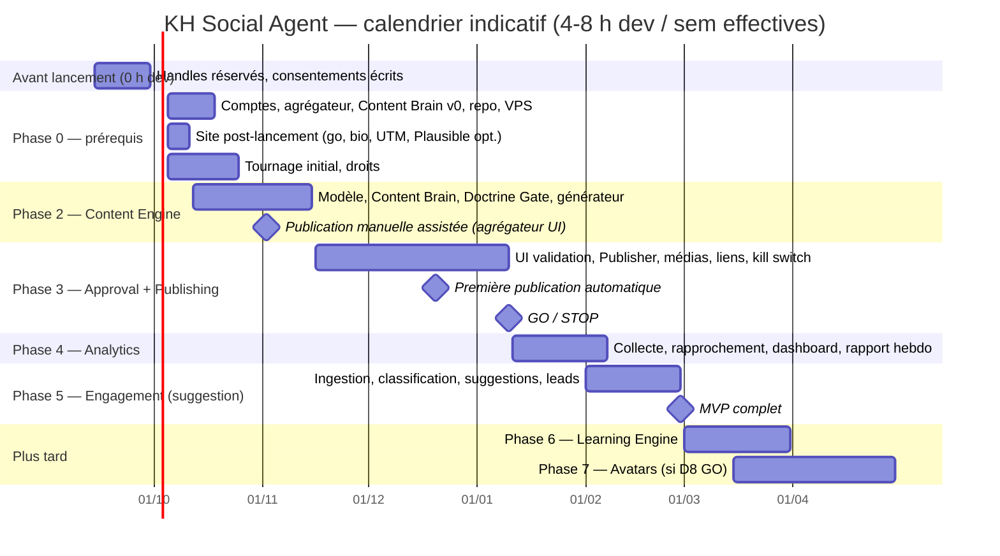

# KH Social Agent — Définition du MVP, backlog priorisé, complexité

- **Date** : 2026-09-12 (révisé après revue adversariale)
- **Statut** : 🟡 proposition, à valider avec [04-decisions.md](04-decisions.md) D1-D3
- **Unité d'estimation** : heures de travail **Alain + Claude Code** (développement assisté), hors temps de tournage et hors attente des tiers. Deux colonnes : **base** et **pessimiste** (×1,5 à ×2, parce que la stack Python / Postgres / VPS est nouvelle pour le projet et que le site a déjà glissé deux fois).

---

## 1. Définition précise du MVP

### 1.1 Ce que le MVP fait

| Capacité | Détail | Phase |
|---|---|---|
| Générer | idées → briefs → variantes par plateforme (Instagram, TikTok, Pinterest, YouTube Shorts ; LinkedIn page en option), FR/EN, hooks, CTA, hashtags, script vidéo, slot recommandé | 2 |
| Cadrer | calendrier hebdomadaire, **4 à 6 variantes par semaine** au MVP (la cadence suit la capacité réelle de production de médias), à partir des objectifs, du calendrier cadre et des 7 territoires ; historique | 2 |
| Garder | Doctrine Gate lexical normalisé + LLM sur tout texte public, sur le **hash** du texte publié ; passe visuelle sur les médias ; vérité produit depuis WooCommerce | 2 |
| Valider | file de validation web mobile-first, aperçu par plateforme, approuver / modifier (re-gate) / rejeter, diff conservé, notifications | 3 |
| Publier | publication automatique au slot des contenus approuvés via l'agrégateur ; **planification côté agent** ; retries ; kill switch ; audit | 3 |
| Tracer | liens `/go/<code>` avec UTM (fichier de codes versionné côté site) ; page « lien en bio » manuelle | 3 |
| Mesurer | snapshots J+1 / J+3 / J+7 / J+28 ; rapprochement WooCommerce + Fluent Forms + journal `/go/` (Plausible Stats API en option) ; tableau de bord entonnoir ; rapport hebdo | 4 |
| Écouter | ingestion des commentaires, classification en 11 catégories + segment, **réponses suggérées** (jamais automatiques), escalade, événement `lead.detected` | 5 (mode suggestion) |

### 1.2 Ce que le MVP ne fait pas

- Réponses automatiques aux commentaires (Phase 5b après mesure de précision et de rappel).
- Auto-approbation par l'agent (D19, hors MVP), likes, follows, reposts automatisés (jamais).
- Apprentissage automatisé, tests A/B (Phase 6). Le rapport hebdo du MVP est **descriptif** et propose des hypothèses en texte, sans les gérer.
- Avatars (Phase 7).
- DM, publicité, Threads, Facebook, espace CRM.
- Connecteurs directs aux plateformes (après le MVP, plateforme par plateforme, si D1 évolue).
- Écriture côté WordPress (page bio, codes `/go/`) : manuelle ou déployée avec le site.

### 1.3 Critères d'acceptation du MVP

1. 4 plateformes connectées ; **20 contenus publiés via l'agent sur 4 semaines** (cadence 4-6 / semaine) sans incident de doctrine (audit grep normalisé + relecture : zéro terme interdit, zéro image non vérifiée).
2. 100 % des publications tracées : `approval` + `gate_result` sur le hash publié + `publication` + lien traçable.
3. Rapport hebdo automatique produit 4 semaines de suite, avec la part « attribuable / non attribuable » du trafic et des commandes, et la part de vraies vidéos.
4. Taux d'édition humaine médian à l'approbation < 30 % (sinon prompts en révision avant Phase 6).
5. Classification des commentaires, mesurée sur un **jeu semi-synthétique de 100 cas** (messages Etsy anonymisés + cas générés, parce qu'un compte de deux mois n'a pas 100 vrais commentaires) : précision ≥ 90 % sur `SPAM`, `COMPLIMENT`, `B2B_PROSPECT`, `CUSTOM_REQUEST` **et rappel ≥ 95 %** sur les catégories d'escalade (`COMPLAINT`, `CRITICISM`, `PRESS_INFLUENCE`, `PARTNERSHIP`).
6. Kill switch testé en conditions réelles (une publication planifiée dé-planifiée en < 1 minute, planification étant côté agent).
7. Point **GO / STOP** formel après la Phase 3 : le système est déjà utile (génération + validation + publication + liens) ; les phases 4-5 ne démarrent que si la cadence tient et si MaïJinn le permet.

---

## 2. Phases et calendrier proposé

Hypothèse : **aucune heure de développement avant le 30 septembre** (D2) ; démarrage développement **semaine du 5 octobre 2026** ; capacité **10-15 h / semaine tout compris** : développement, exploitation (2-3 h) et production de contenu (4-6 h : tournage, montage, relecture). Il reste donc **4 à 8 h / semaine de développement effectif**, d'où un calendrier plus long que la somme des heures ne le suggère.

Le jalon utile le plus précoce est **la publication manuelle assistée** (début novembre) : le Content Engine produit, Alain colle dans l'interface de l'agrégateur. L'audience commence à croître avant que la Phase 3 existe. Si Alain dégage 12 h / semaine de développement pur (MaïJinn en pause), le calendrier se compresse d'environ un tiers.

---

## 3. Backlog priorisé

Priorités : **P0** = bloquant pour le jalon suivant · **P1** = MVP · **P2** = post-MVP. Taille : S ≤ 3 h · M 4-8 h · L 9-16 h (base).

### Avant le 30 septembre (zéro développement)

| ID | Ticket | Qui | Taille | Prio |
|---|---|---|---|---|
| KHS-001 | Réserver les handles (`koinoborihouse`) sur les 5 plateformes, comptes en privé, sans lien depuis le site (O-5) | Alain | S (1 h) | P0 |
| KHS-003 | Consentements écrits Catherine / Alain (image, voix, avatar, délégation d'approbation éventuelle), formulaire UGC type FR/EN rédigé par Claude, validé par Alain | Alain, Catherine | S | P0 |

### Phase 0 — Prérequis (à partir du 5 octobre)

| ID | Ticket | Qui | Taille base / pessimiste | Prio | Dépend de |
|---|---|---|---|---|---|
| KHS-002 | Comptes professionnels : Instagram Business + Page Facebook liée, TikTok Business, Pinterest Business + site revendiqué, chaîne YouTube (compte de marque), page LinkedIn ; bios FR/EN, avatars de profil, bannières, lien de bio vers la homepage | Alain + Claude | M (4 h) / 6 h | P0 | KHS-001, D3, D18 |
| KHS-004 | Content Brain v0 : `brand-voice.md`, `doctrine.md` **importé** par SHA, `personas/` (celui de Catherine validé par elle), `platforms/`, `calendar-frame.yaml`, `kairo/` (épisodes 1-4 + titres des chapitres, **sans synopsis ni date**) | Alain + Claude, Catherine | L (8-10 h) / 14 h | P0 | [05](05-audit-existant.md) §3 |
| KHS-005 | Photothèque / vidéothèque initiale + registre des droits ; **aligné sur le shooting produit du site** (les fiches n'ont pas d'images au 07/09) | Alain, Catherine | 1 jour de tournage | **P0** | KHS-003 |
| KHS-006 | Compte agrégateur (essai), connexion des comptes, test de publication manuelle sur chaque plateforme, DPA signé | Alain | S / 4 h | P0 | D1, KHS-002 |
| KHS-007 | **Site** : page « lien en bio » `noindex`, mu-plugin `/go/<code>` (table de codes versionnée, cibles restreintes au domaine, `no-store`, journal), exclusion LiteSpeed, champs cachés UTM sur Fluent Forms 5-12, utilisateur WordPress dédié + Application Password + liste blanche IP ; Plausible Business en option | Claude + Alain | M (6-8 h) / 12 h | P1 | D14 |
| KHS-008 | Repo `kh-social-agent`, VPS, Docker Compose (Postgres + app + worker), stockage objet UE, CI (lint, tests), secrets, sauvegarde base **testée en restauration**, CODEOWNERS | Claude | M (6-8 h) / 12 h | P0 | D10 |
| KHS-009 | Ligne d'exploitation récurrente : mises à jour, monitoring, test de restauration mensuel, rotation des tokens, ré-auth LinkedIn J+55 | Alain | 2-3 h / semaine | P1 | KHS-008 |

### Phase 2 — Content Engine (base ~36 h, pessimiste ~60 h)

| ID | Ticket | Taille | Prio | Critère d'acceptation |
|---|---|---|---|---|
| KHS-100 | Modèle de données §4 de [01](01-architecture.md) + migrations + fixtures (dont `autonomy_policy`, `content_hash`, `visual_check`) | M | P0 | contraintes d'intégrité §4.3 testées |
| KHS-101 | Content Brain loader : git → contexte structuré, import `doctrine.md` par SHA avec test CI, cache produits WooCommerce (REST lecture seule, 1 h), hash de contexte | M | P0 | un prix absent de WooCommerce ne peut pas apparaître dans une caption ; la CI échoue si la doctrine Koinobori a changé sans réimport |
| KHS-102 | Doctrine Gate texte v1 : lexique normalisé (NFKD, casefold, sous-chaîne dans les hashtags) + prompt `doctrine_gate.md` (sorties structurées) + score brand voice + jeu de tests (≥ 60 cas : minuscules, majuscules, sans accents, hashtags, anglais, faux positifs connus) | M (6-8 h) | P0 | 0 faux négatif, liste de faux positifs qui passent |
| KHS-103 | Générateur : `generate_ideas` → `generate_brief` → `generate_variant_<platform>` (5 prompts), sorties structurées, appels groupés pour le cache, enregistrement `prompt_version_id` | L (10 h) | P0 | 10 briefs → 40 variantes conformes, taux d'édition mesurable |
| KHS-104 | Calendrier hebdo : mix territoires depuis `strategy/current.md`, calendrier cadre, créneaux recommandés, anti-répétition, cadence 4-6 | M | P1 | proposition du lundi générée en < 5 min |
| KHS-105 | Sortie « publication manuelle » : export par variante (texte prêt à coller, médias, lien traçable, checklist gate) | S | P0 | jalon m1 |
| KHS-106 | CLI d'administration (générer, lister, exporter, marquer publié à la main) | S | P1 | |

### Phase 3 — Approval + Publishing (base ~45 h, pessimiste ~75 h)

| ID | Ticket | Taille | Prio | Critère d'acceptation |
|---|---|---|---|---|
| KHS-200 | UI de validation (FastAPI + Jinja2 + HTMX) : file, filtres, aperçu fidèle, approuver / modifier (**re-gate automatique**) / rejeter / HITL, diff, case « relu » sur les `FLAG`, auth par lien magique, mobile, rôles Alain / Catherine | L (12-14 h) | P0 | Alain valide 10 variantes depuis son téléphone ; un contenu Catherine exige sa décision ou sa délégation |
| KHS-201 | Notifications (Telegram ou e-mail) avec aperçu et actions rapides ; Telegram inscrit au registre RGPD | S | P1 | |
| KHS-202 | Interface `Publisher` + adapter agrégateur : upload média, **publication immédiate au slot seulement** (jamais la planification du fournisseur), statut, permalien, erreurs normalisées | M (8 h) | P0 | publication sur les 4 plateformes depuis un compte de test |
| KHS-203 | Media Engine minimal : passe visuelle `visual_check.md` (vision + OCR) avant `public_ok`, image → formats par plateforme (HTML → PNG), vidéo → 9:16 + sous-titres (FFmpeg), cover ; vérification de l'API Canva avant tout usage | M (8 h) | P0 | aucun média publié sans `visual_check` PASS |
| KHS-204 | Liens traçables : générateur de codes (≥ 6 caractères), builder UTM, fichier de codes `/go/` versionné dans le repo Koinobori (PR), cibles restreintes | S | P0 | chaque variante avec CTA lien a un `tracked_link` |
| KHS-205 | Kill switch global / par compte, quotas par compte, retries avec back-off, timeout `PUBLISHING`, `audit_log` | M | P0 | critère MVP 6 |
| KHS-206 | Tests d'intégration bout en bout (variante → gate → média → gate final → approbation → publication → permalien ; modification → re-gate) | S | P1 | |

### Phase 4 — Analytics (base ~24 h, pessimiste ~40 h)

| ID | Ticket | Taille | Prio | Critère d'acceptation |
|---|---|---|---|---|
| KHS-300 | Collecte métriques par publication et par compte (agrégateur), snapshots J+1 / J+3 / J+7 / J+28, normalisation + `raw` | M (6 h) | P0 | |
| KHS-301 | Rapprochement site : WooCommerce REST (commandes avec `_wc_order_attribution_*`), Fluent Forms (utilisateur dédié), journal `/go/` ; Plausible Stats API si le plan Business est activé → `site_conversion` | M (8 h) | P0 | une commande de test avec UTM apparaît attribuée |
| KHS-302 | Tableau de bord : entonnoir par plateforme / territoire / format / personne, attribuable vs non attribuable, part US, part de vraies vidéos, top et flop | M (6 h) | P1 | |
| KHS-303 | Rapport hebdo automatique (descriptif, hypothèses en texte libre, sans gestion) | M (4 h) | P1 | critère MVP 3 |

### Phase 5 — Engagement en mode suggestion (base ~22 h, pessimiste ~36 h)

| ID | Ticket | Taille | Prio | Critère d'acceptation |
|---|---|---|---|---|
| KHS-400 | Ingestion commentaires et mentions (webhook agrégateur si disponible, sinon polling horaire), dédoublonnage, `retention_until` par plateforme, job de purge | M (5 h) | P0 | |
| KHS-401 | Classifieur 11 catégories + segment + sensibilité + confiance ; jeu semi-synthétique de 100 cas ; mesure précision et rappel | M (6 h) | P0 | critère MVP 5 |
| KHS-402 | Réponses suggérées (prompt `draft_reply.md` alimenté par le Content Brain : prix, livraison, doctrine), passage par le gate, validation dans l'UI, envoi | M (5 h) | P1 | |
| KHS-403 | `lead.detected` v1 : extraction, `lead_code`, outbox + webhook signé, notification, contrat JSON dans `docs/ecosystem/contracts/` | M (4 h) | P1 | D20 |
| KHS-404 | Mesure de précision et de rappel sur 4 semaines réelles avant toute ouverture d'auto-réponse | S | P1 | |

### Phase 6 — Learning Engine (base ~22 h, post-MVP)

| ID | Ticket | Taille | Prio |
|---|---|---|---|
| KHS-500 | Hypothèses et expériences : modèle, saisie, statuts, seuils d'échantillon | M | P2 |
| KHS-501 | Analyse hebdo → hypothèses structurées (prompt `weekly_analysis.md`), comparaison par rang, mention « échantillon faible » | M | P2 |
| KHS-502 | PR automatique sur la mémoire stratégique (learnings, prompts) via GitHub, prompt registry `VERSIONS.yaml`, CODEOWNERS | M | P2 |
| KHS-503 | Tests pairés (planification A/B sur créneaux comparables) | M | P2 |
| KHS-504 | Auto-approbation conditionnelle (D19), seulement si décidée | S | P2 |

### Phase 7 — Avatars (base ~20 h + tournage, post-MVP, conditionnée par D8)

| ID | Ticket | Taille | Prio |
|---|---|---|---|
| KHS-600 | Enregistrement des consentements, footage et voix, création des jumeaux chez le fournisseur retenu | tournage | P2 |
| KHS-601 | Pilote 5 vidéos via l'interface du fournisseur, revue qualité par Catherine et Alain, décision GO / NO-GO, test du kill switch de retrait | S | P2 |
| KHS-602 | Intégration API (HeyGen v3 en principal) : script → vidéo → sous-titres → 9:16 → mention IA **incrustée dès la première seconde** + champs natifs par plateforme → Media Engine | M (8 h) | P2 |
| KHS-603 | Gabarits de scénarios : face caméra, voix off, présentation produit, storytelling, teaser ; règle de choix de la personne par territoire | M | P2 |
| KHS-604 | Suivi du ratio vraies vidéos / avatars (D9) dans le tableau de bord | S | P2 |

---

## 4. Estimation de complexité

| Phase | Heures dev base | Pessimiste | Complexité | Principaux risques |
|---|---|---|---|---|
| Avant lancement | 0 h dev (2 h admin) | | nulle | consentement de Catherine |
| 0 Prérequis | ~26 h dev + ~10 h admin + 1 jour de tournage | ~45 h | faible, dépend de tiers | revendication du site Pinterest ; Page Facebook ; Content Brain v0 sous-estimé |
| 2 Content Engine | 30-38 h | 50-60 h | moyenne | qualité du Content Brain v0 ; lexique et passe visuelle à ajuster sur cas réels |
| 3 Approval + Publishing | 40-48 h | 65-80 h | moyenne-haute | comportement de l'agrégateur par plateforme ; UI mobile ; passe visuelle |
| 4 Analytics | 20-28 h | 35-45 h | moyenne | part « Unknown » de l'attribution WooCommerce ; latences plateformes (48-72 h YouTube) |
| 5 Engagement | 18-26 h | 30-40 h | moyenne | rappel du classifieur sur peu de données ; absence de webhook commentaires selon le fournisseur |
| **MVP (0 + 2 + 3 + 4 + 5)** | **≈ 135-165 h** | **≈ 225-270 h** | | à 4-8 h de dev effectif / semaine : **5 mois** (fin février 2027) ; à 12 h : ~3 mois |
| Exploitation récurrente | 2-3 h / semaine dès la Phase 3 | | | |
| Production de contenu | 4-6 h / semaine dès la Phase 2 | | | c'est la ligne la plus souvent oubliée ; sans elle, l'agent n'a rien à publier |
| 6 Learning | 18-26 h | 30-45 h | haute (méthode) | faible volume statistique ; sur-interprétation |
| 7 Avatars | 16-24 h + tournage | 30-40 h | moyenne | qualité perçue ; label permanent à l'écran ; conformité |
| **Total programme** | **≈ 170-215 h** | **≈ 285-355 h** | | |

Lecture : le MVP consomme, en base, un volume comparable à un demi Lot 7 du site ; en pessimiste, un Lot 7 entier. Le découpage permet d'**arrêter après la Phase 3** (point GO / STOP) avec un système déjà utile, et de laisser les phases 4-5 glisser si MaïJinn reprend le focus.

---

## 5. Ordre de valeur

Si le temps manque, voici ce qui produit le plus de valeur par heure, dans l'ordre :

1. **KHS-004 + KHS-102 + KHS-103** : un Content Brain solide et un générateur gardé par la doctrine. Même en publication manuelle, c'est 80 % du gain de temps éditorial.
2. **KHS-005** : des images et des vidéos maison. Sans elles, rien à publier et l'avatar devient une tentation de remplacement, contraire au brief.
3. **KHS-204 + KHS-007** : les liens traçables. Sans eux, aucune mesure business n'est possible.
4. **KHS-200 + KHS-202 + KHS-203** : validation, passe visuelle et publication automatiques, qui rendent la cadence tenable.
5. **KHS-301 + KHS-303** : le rapport hebdo qui relie posts et commandes.
6. **KHS-401 + KHS-403** : les leads détectés dans les commentaires, premier pont vers le Sales Agent.

Tout le reste est du confort ou de l'apprentissage, à faire quand les données existent.
